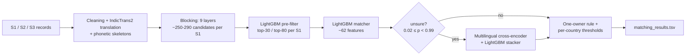

# Business Entity Resolution — Amazon ML Challenge 2026

Matching **1.73M businesses** against a **10M-record multilingual pool** (US, India, France) with
multi-layer blocking, a LightGBM matcher and a fine-tuned multilingual cross-encoder.

**Final leaderboard F0.5: 0.966** · Held-out F0.5 (India + US): **0.9751**

> Team project built during the 3-day Amazon ML Challenge 2026 hackathon by a team of **4 members**.

---

## Team

| Member | Main contributions |
|---|---|
| _Name 1_ | test-side pipeline, inference, submissions |
| _Name 2_ | train-side pipeline, matcher training |
| _Name 3_ | blocking (test), cross-encoder |
| _Name 4_ | blocking (train), analyses, cross-encoder |

---

## The problem

For every business in Source 1 (S1), find **all** records describing the same business in Sources 2 and 3
(S2/S3). Records are noisy: typos and swapped letters, reordered words, changed legal suffixes, blank or
partial addresses, domain-style names, names written in **9 Indian scripts** (15% of S2), and "sibling"
businesses that share a name and address but differ in legal form. The test set adds **France**, a
country with no training data.

**Metric:** macro-averaged F0.5 per S1 entity (precision weighted twice as much as recall).

---

## Results

| Version | What changed | Held-out F0.5 (India+US) | Leaderboard |
|---|---|---|---|
| v1 | 4-layer blocking + LightGBM matcher | 0.9172 | — |
| v2 | legal-form + phonetic features, one-owner rule | 0.9432 | — |
| v3 | Phase B + C blocking, translated names | 0.9644 | 0.9556 |
| **v3 + cross-encoder** | **fine-tuned cross-encoder + stacker on unsure pairs** | **0.9751** | **0.966** |

**Blocking recall** (share of true matches that reach the matcher, held-out):

| | Layers L1–L4 | + L5–L7 | + L8 / L2t |
|---|---|---|---|
| India | 90.0% | 92.7% | **98.2%** |
| US | 97.4% | 98.1% | **99.2%** |

Held-out gains transferred to the leaderboard almost exactly (+1.09 held-out vs +1.04 leaderboard).

---

## Pipeline



### Key ideas

- **Blocking designed from a miss analysis.** We analysed 94K missed true pairs. Half of India's misses were
  Indian-script names; most others had partial evidence spread across name and address.
- **L8: exact, weighted token search.** Typed tokens (name words and pairs, phonetic-skeleton words,
  sorted-letter keys for swapped letters, address words, numbers, address word pairs), IDF-weighted and
  restricted to rare tokens. Name and address are scored separately and combined, so a blank field hands its
  weight to the fields that exist. This alone lifted India's blocking recall from 92.7% to 98.2%.
- **Translation for non-Latin names.** IndicTrans2 made 96% of missed non-Latin names match their English
  S1 name exactly, against 46% with rule-based transliteration.
- **Sibling-aware matching.** Legal-form comparison (same / different / missing), including forms read from
  native scripts, separates businesses like "X Ventures LLP" and "X Ventures Limited".
- **Cross-encoder on unsure pairs only.** A fine-tuned multilingual MiniLM reads both raw records and
  re-scores the ~5% of pairs the matcher is unsure about. A LightGBM stacker blends both scores with
  per-entity context.
- **One-owner rule.** No S2/S3 record belongs to more than one S1 (verified on 7.6M training matches), so
  each record goes to its highest-scoring claimant.
- **Honest evaluation.** Hash-bucket splits and 2-fold cross-fitting over entities for every tuning choice.

---

## Repository structure

```
.
├── src/
│   ├── 01_blocking/          # L1–L4, Phase B (L5–L7), Phase C (L8, L2t)
│   ├── 02_translation/       # IndicTrans2 translation of non-Latin names
│   ├── 03_matching/          # text prep, matcher training, test inference, held-out predictions
│   ├── 04_cross_encoder/     # training + evaluation, stacker, export, test scoring, final apply
│   ├── utils/                # EDA, validator, helper cells
│   ├── experiments_not_in_final/   # v4 matcher, probes and analyses (documented, not submitted)
│   └── kaggle_notebooks_executed/  # notebooks with their outputs, as actually run
├── requirements.txt
├── Documentation.md          # full methodology write-up
└── README.md
```

Each script is a Kaggle notebook exported as cells (`# %% [CELL n]`), with an `.ipynb` copy next to it.

---

## How to reproduce

**Environment:** Kaggle notebooks (4 CPU cores, 30 GB RAM, T4 GPU where marked), Python 3.12,
versions pinned in `requirements.txt`. Set the paths (`DATA_ROOT`, `INPUT_ROOT`, `WORK`) in each script's
first cell. Scripts with a `SMOKE` flag: run once with `SMOKE = True` (quick check), then `SMOKE = False`.
All seeds are fixed at 42.

**Data:** the competition data isn't included in this repository.

| # | Script (`src/`) | Hardware | Output |
|---|---|---|---|
| 1 | `01_blocking/1_blocking_L1_L4.py` (test + train) | GPU | `ckpt_<mode>/` |
| 2 | `01_blocking/2_blocking_phaseB_L5_L7.py` (test + train) | GPU | `ckpt_b_<mode>/` |
| 3 | `02_translation/translation_indictrans2.py` (test + train) | GPU, HF token | `translations_<mode>.parquet` |
| 4 | `01_blocking/3_blocking_phaseC_L8_L2t.py` (test + train) | GPU | `ckpt_c_<mode>/` |
| 5 | `03_matching/0_test_text_prep.py` | CPU | `prep_test/` |
| 6 | `03_matching/1_train_v3.py` | CPU | `stage2_models_v3/` |
| 7 | `03_matching/2_predict_v3.py` | CPU | `stage2_v3_output/` |
| 8 | `03_matching/3_heldout_predictions_v3.py` | CPU | `heldout_v3.parquet` |
| 9 | `04_cross_encoder/1_ce_train_eval.py` | GPU | `ce_model/` |
| 10 | `04_cross_encoder/2_ce_stacker_select.py` → `2b_resave_band_0.02_0.99.py` | GPU | stacker + config |
| 11 | `04_cross_encoder/3_export_band_pairs.py` | CPU | `ce_band_test.parquet` |
| 12 | `04_cross_encoder/4_ce_score_test.py` | GPU | `ce_test.parquet` |
| 13 | `04_cross_encoder/5_apply_final.py` | CPU | **`matching_results.tsv`, `candidate_pairs.tsv`** |

**Total runtime:** about 12–14 hours across Kaggle sessions (blocking ~4 h, translation ~0.5 h, training
~2 h, test inference ~2.5 h, cross-encoder ~2 h). We split independent steps across the team's 4 Kaggle
accounts to run them in parallel.

**Exact-reproduction note:** in the submitted run, India and US were scored in step 7 with LightGBM
prediction early stopping at margin 8, so step 13 clamps their cross-encoder band to (0.018, 0.982). The
included step 7 uses margin 20 (exact probabilities). Rerunning it reproduces the submission up to negligible
differences. For an exact match, set `pred_early_stop_margin=8.0` for India and US in step 7.

---

## Models

All models are open-licensed, well under the 8B-parameter limit, and run locally. No external APIs or data.

| Model | Licence | Size | Used for |
|---|---|---|---|
| `sentence-transformers/paraphrase-multilingual-MiniLM-L12-v2` | Apache-2.0 | 118M | blocking embeddings (L3); fine-tuned as the cross-encoder |
| `ai4bharat/indictrans2-indic-en-dist-200M` | MIT | 200M | Indian-script → English name translation |
| LightGBM | MIT | — | pre-filter, matcher, stacker |

---

## What we learned

- **Blocking sets the ceiling.** No matcher can recover a pair blocking missed; the biggest jumps came
  from studying what blocking missed.
- **Compressed vectors blur rare words.** Exact sparse search over *rare* tokens was both faster and more
  accurate than we expected.
- **Measure before building.** Small probes (translation, L8, diagnostics) killed several ideas before they
  cost hours, and confirmed the ones that worked.
- **Zero-shot countries stay hard.** France (no labels) remained the largest gap, at an estimated ~0.91 F0.5.

---

## Acknowledgements

Amazon ML Challenge 2026 organisers, AI4Bharat (IndicTrans2), and the authors of Sentence-Transformers,
LightGBM and rapidfuzz.
