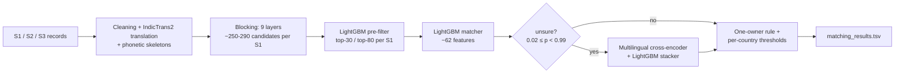

# Business Entity Resolution — Amazon ML Challenge 2026

Matching **1.73M businesses** against a **10M-record multilingual pool** (US, India, France) with
multi-layer blocking, a LightGBM matcher and a fine-tuned multilingual cross-encoder.

**Final leaderboard F0.5: 0.966** · Held-out F0.5 (India + US): **0.9751**

> Team project built during the 3-day Amazon ML Challenge 2026 hackathon by a team of **4 members**.

---

## Team

| Member | Main contributions |
|---|---|
| Jyotiprakash | test-side pipeline, inference, submissions |
| Siddarth | train-side pipeline, matcher training |
| Vedaansh | blocking (test), cross-encoder |
| Mahima | blocking (train), analyses, cross-encoder |

---

## The problem

For every business in Source 1 (S1), find **all** records describing the same business in Sources 2 and 3
(S2/S3). Records are noisy: typos and swapped letters, reordered words, changed legal suffixes, blank or
partial addresses, domain-style names, names written in **9 Indian scripts** (15% of S2), and "sibling"
businesses that share a name and address but differ in legal form. The test set adds **France**, a
country with no training data.

**Metric:** macro-averaged F0.5 per S1 entity (precision weighted twice as much as recall).

---

## Results

| Version | What changed | Held-out F0.5 (India+US) | Leaderboard |
|---|---|---|---|
| v1 | 4-layer blocking + LightGBM matcher | 0.9172 | — |
| v2 | legal-form + phonetic features, one-owner rule | 0.9432 | — |
| v3 | Phase B + C blocking, translated names | 0.9644 | 0.9556 |
| **v3 + cross-encoder** | **fine-tuned cross-encoder + stacker on unsure pairs** | **0.9751** | **0.966** |

**Blocking recall** (share of true matches that reach the matcher, held-out):

| | Layers L1–L4 | + L5–L7 | + L8 / L2t |
|---|---|---|---|
| India | 90.0% | 92.7% | **98.2%** |
| US | 97.4% | 98.1% | **99.2%** |

Held-out gains transferred to the leaderboard almost exactly (+1.09 held-out vs +1.04 leaderboard).

---

## Pipeline

### Key ideas

- **Blocking designed from a miss analysis.** We analysed 94K missed true pairs. Half of India's misses were
  Indian-script names; most others had partial evidence spread across name and address.
- **L8: exact, weighted token search.** Typed tokens (name words and pairs, phonetic-skeleton words,
  sorted-letter keys for swapped letters, address words, numbers, address word pairs), IDF-weighted and
  restricted to rare tokens. Name and address are scored separately and combined, so a blank field hands its
  weight to the fields that exist. This alone lifted India's blocking recall from 92.7% to 98.2%.
- **Translation for non-Latin names.** IndicTrans2 made 96% of missed non-Latin names match their English
  S1 name exactly, against 46% with rule-based transliteration.
- **Sibling-aware matching.** Legal-form comparison (same / different / missing), including forms read from
  native scripts, separates businesses like "X Ventures LLP" and "X Ventures Limited".
- **Cross-encoder on unsure pairs only.** A fine-tuned multilingual MiniLM reads both raw records and
  re-scores the ~5% of pairs the matcher is unsure about. A LightGBM stacker blends both scores with
  per-entity context.
- **One-owner rule.** No S2/S3 record belongs to more than one S1 (verified on 7.6M training matches), so
  each record goes to its highest-scoring claimant.
- **Honest evaluation.** Hash-bucket splits and 2-fold cross-fitting over entities for every tuning choice.

---

## Repository structure

All notebooks are the Kaggle notebooks as actually run, with their outputs. They're listed here in
pipeline order.

| Notebook | Pipeline step |
|---|---|
| [`eda-dataexploration.ipynb`](eda-dataexploration.ipynb) | Exploratory data analysis: sizes, noise types, scripts, match statistics |
| [`pre-blocking.ipynb`](pre-blocking.ipynb) | Blocking layers L1–L4 on **test** (TF-IDF + SVD, multilingual embeddings, address keys, GPU top-K) and test text preparation _(please confirm)_ |
| [`notebook2-train.ipynb`](notebook2-train.ipynb) | Phase B blocking (L5 address TF-IDF, L6 exact keys, L7 phonetic skeletons) on **train** + recall report |
| [`test-blocking-b.ipynb`](test-blocking-b.ipynb) | Phase B blocking on **test** |
| [`phasec-blocking-train.ipynb`](phasec-blocking-train.ipynb) | Phase C blocking (L8 exact weighted token search, L2t translated names) on **train** + recall report |
| [`phasec-blocking-test.ipynb`](phasec-blocking-test.ipynb) | Phase C blocking on **test** |
| [`model-train-on-v3.ipynb`](model-train-on-v3.ipynb) | Matcher v3: pre-filter + LightGBM matcher training, held-out evaluation, thresholds |
| [`v3-test-predict.ipynb`](v3-test-predict.ipynb) | Test inference with v3, export of unsure pairs, final cross-encoder apply → **submission files** |
| [`step2-v4.ipynb`](step2-v4.ipynb) | Experiment, **not in the final submission**: v4 matcher test inference ("which words differ" features) |

**Steps run in notebooks not included here:** blocking layers L1–L4 on train, the IndicTrans2 translation
pre-step (test and train), the held-out diagnostics, and the **cross-encoder notebook** (fine-tuning,
held-out evaluation, stacker selection and scoring of the unsure test pairs). The cross-encoder's outputs
(the stacker, its configuration and the test-pair scores) were used by the final apply step in
`v3-test-predict.ipynb`.

---

## How to reproduce

**Environment:** Kaggle notebooks (4 CPU cores, 30 GB RAM, T4 GPU for blocking, translation and the
cross-encoder), Python 3.12. Main libraries: PyTorch, Transformers, LightGBM, scikit-learn, pandas, NumPy,
SciPy, rapidfuzz, pyarrow, indic-transliteration, IndicTransToolkit. Set the paths (`DATA_ROOT`,
`INPUT_ROOT`, `WORK`) in each notebook's first cell. Notebooks with a `SMOKE` flag: run once with
`SMOKE = True` (quick check), then `SMOKE = False`. All seeds are fixed at 42.

**Data:** the competition data isn't included in this repository.

**Order:**
1. **Blocking:** L1–L4 (`pre-blocking` on test) → Phase B (`test-blocking-b`, `notebook2-train`) →
   translation → Phase C (`phasec-blocking-test`, `phasec-blocking-train`)
2. **Matcher:** `model-train-on-v3` → `v3-test-predict` (test scores)
3. **Cross-encoder:** fine-tune and evaluate the cross-encoder, select the stacker (notebook not included)
   → export unsure test pairs (in `v3-test-predict`) → score them with the cross-encoder → final apply
   (in `v3-test-predict`) → `matching_results.tsv`, `candidate_pairs.tsv`

**Total runtime:** about 12–14 hours across Kaggle sessions (blocking ~4 h, translation ~0.5 h, training
~2 h, test inference ~2.5 h, cross-encoder ~2 h). We split independent steps across the team's 4 Kaggle
accounts to run them in parallel.

**Exact-reproduction note:** in the submitted run, India and US were scored in the v3 test inference with
LightGBM prediction early stopping at margin 8, so the final apply clamps their cross-encoder band to
(0.018, 0.982). Using margin 20 instead gives exact probabilities and reproduces the submission up to
negligible differences.

---

## Models

All models are open-licensed, well under the 8B-parameter limit, and run locally. No external APIs or data.

| Model | Licence | Size | Used for |
|---|---|---|---|
| `sentence-transformers/paraphrase-multilingual-MiniLM-L12-v2` | Apache-2.0 | 118M | blocking embeddings (L3); fine-tuned as the cross-encoder |
| `ai4bharat/indictrans2-indic-en-dist-200M` | MIT | 200M | Indian-script → English name translation |
| LightGBM | MIT | — | pre-filter, matcher, stacker |

---

## What we learned

- **Blocking sets the ceiling.** No matcher can recover a pair blocking missed; the biggest jumps came
  from studying what blocking missed.
- **Compressed vectors blur rare words.** Exact sparse search over *rare* tokens was both faster and more
  accurate than we expected.
- **Measure before building.** Small probes (translation, L8, diagnostics) killed several ideas before they
  cost hours, and confirmed the ones that worked.
- **Zero-shot countries stay hard.** France (no labels) remained the largest gap, at an estimated ~0.91 F0.5.

---

## Acknowledgements

Amazon ML Challenge 2026 organisers, AI4Bharat (IndicTrans2), and the authors of Sentence-Transformers,
LightGBM and rapidfuzz.
